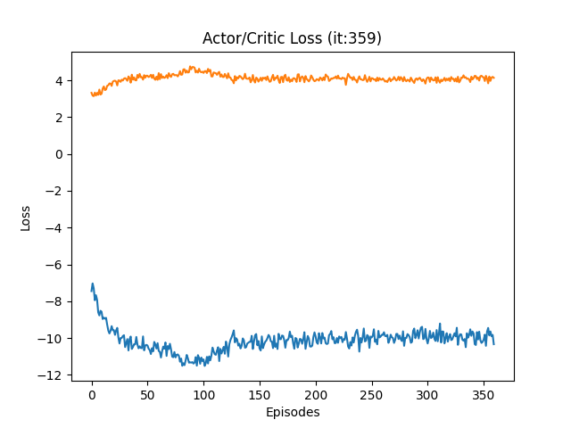
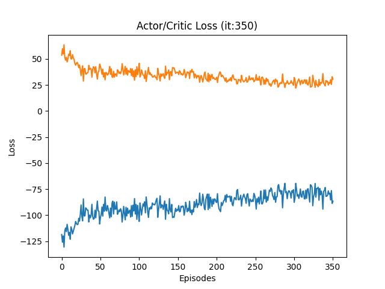
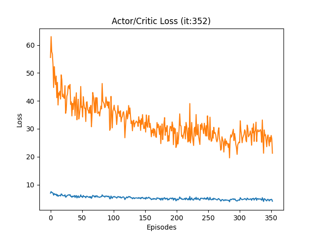
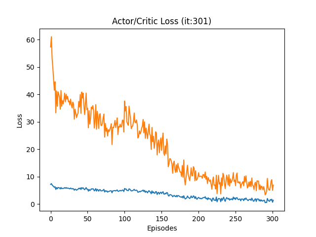
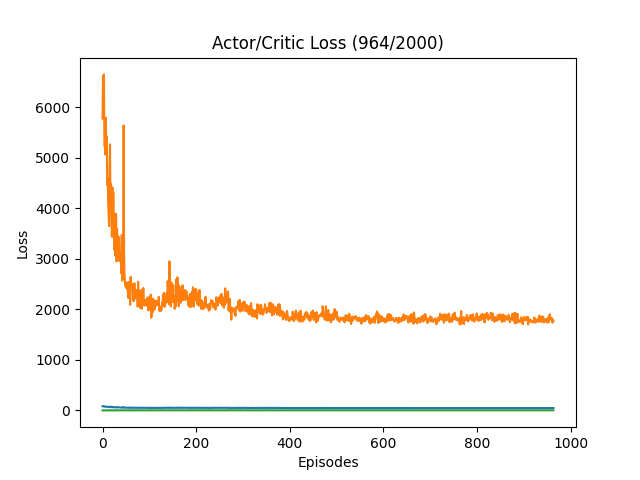

# deepRL_cheetah
with torque as SIM input (nino3 with action input)

## DONE:
- implement GAE: as discribed in ActorCritic slides
- implement PPO: ActorCritic slides, https://spinningup.openai.com/en/latest/algorithms/ppo.html
- plot and dynamically update Actor/Critic loss and rewards
- use LTSM as hidden layer for network: 
    * https://github.com/Kaixhin/ACER/tree/master
- adapt reward-functions: 
    * https://www.nature.com/articles/s41598-023-38259-7 
    * https://colab.research.google.com/github/google-deepmind/mujoco/blob/main/mjx/tutorial.ipynb#scrollTo=y79PoJOCIl-O

## TODO:
- check implementations
- calculate feet position
- add experience replay

## RESULTS:

### Actor/Critic losses without changes

### Actor/Critic losses without changes

### Actor/Critic losses with GAE and PPO

### Actor/Critic losses with GAE, PPO and LSTM

### Actor/Critic losses with GAE, PPO, LSTM and adapted reward functions
