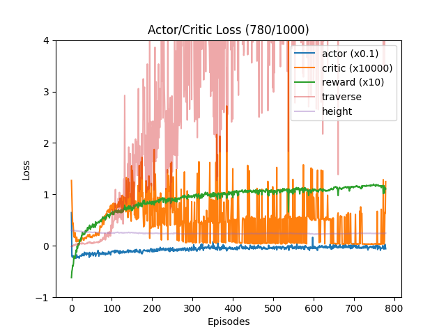

# deepRL_cheetah

## DONE:
- works without torque as input for sim

## TODO:
- check implementations
- make it work with torque

## RESULTS

## RESOURCES
* https://www.nature.com/articles/s41598-023-38259-7
* https://arxiv.org/pdf/2109.11978.pdf
* https://github.com/leggedrobotics/rsl_rl/blob/master/rsl_rl/algorithms/ppo.py
* https://github.com/leggedrobotics/rsl_rl/blob/master/rsl_rl/modules/actor_critic.py
* https://github.com/leggedrobotics/rsl_rl/blob/master/rsl_rl/runners/on_policy_runner.py
* https://github.com/leggedrobotics/rsl_rl/blob/master/rsl_rl/storage/rollout_storage.py
* https://github.com/leggedrobotics/legged_gym/blob/master/legged_gym/envs/base/legged_robot.py
* https://colab.research.google.com/github/google-deepmind/mujoco/blob/main/mjx/tutorial.ipynb#scrollTo=y79PoJOCIl-O